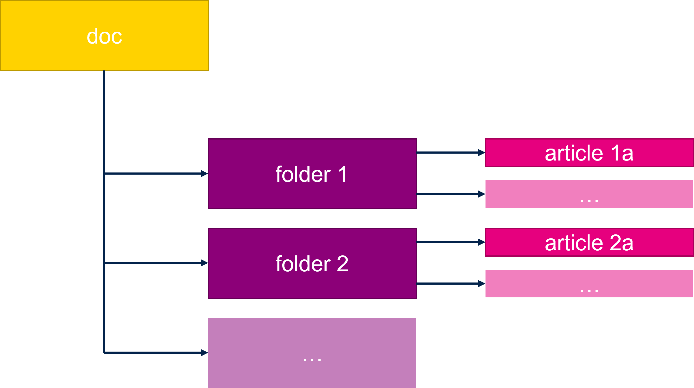

# Create complex content

When will be needed more then one example in repository

## Proposed orgrnization

I propose to create one folder for all documents. Called `doc` and put inside all `md` files. And other folders to contain our examples.


### doc folder



Here we can put all our articles best is to create a folder for each article. As example i can take this wary own content. 


Where i have organization like this

* doc
  * gitGithub
    * complexGitContent.md
    * standaloneGitContent.md
  * img
  * introduction
    * Content.md
  * markdown
    * markdown.md
    * screentogit.md
  * nextsteps
    * planedUpdates.md
  * prerequisities
    * prerequisities.md
  * webpage

Purpose is to searate files for better organization

Second example can be in stm32_threadx repository [Link](https://github.com/RRISTM/stm32_threadx/tree/master/doc)

### example folders

Here i propose to put to root any number of folders contation the examples. Good is to split them by topics. 


as example we can take the 

[https://github.com/RRISTM/stm32_threadx](https://github.com/RRISTM/stm32_threadx)

Where is structure like this

* doc
* examples
  * threadx_add
  * threadx_dynamic_memory_allocation
  * threadx_event_flags_basics
  * ...
* workshop
  * ThreadX_01
  * ThreadX_02
  * ThreadX_03
  * ThreadX_04

This will help all needed examples to one topic on one place. 
Disadvantage is that to have one example user must download complete repository. 

## .gitignore

Because we are using a repo with projects and documents is good to ignore all build files to not increase git size 

proposed git ignore

```
*.o
*.d
*.su
*.mk
*.elf
*.hex
*.bin
*.list
**/Debug
**/.settings
.metadata/
```

## Put all content to github

This will be donw is wame way as in [Standalone git repositroy](./standaloneGitContent.md)